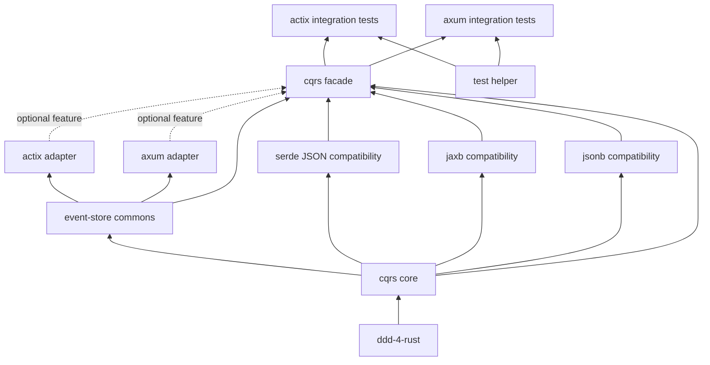

# cqrs-4-rust 一比一迁移实施计划

## 1. 基线与完成定义

- Java 权威基线：`cqrs-4-java` 0.6.0，提交 `1e9d64f58a11f2bc978ce687d98eba811eb9b022`。
- Java 仓库共有 141 个 `.java` 文件；`.mvn/wrapper/MavenWrapperDownloader.java` 属于 Maven 构建工具，不是项目实现。
- 可迁移的产品、测试和生成源码共 **140 个 Java 文件**。
- Rust 最终必须存在 **140 个职责一一对应的迁移 `.rs` 文件**。不得用空文件、占位类型或重复转发文件凑数。
- 每个 Java 文件都必须在迁移清单中对应唯一 Rust 文件；每个 Rust 迁移文件也必须反向关联唯一 Java 文件。
- 权威逐文件账本为 [`docs/migration/file_mapping.csv`](migration/file_mapping.csv)，路径和状态变化必须同步更新该文件。
- facade、crate `lib.rs`、`xtask` glue 和结构验证测试属于 Rust 基础设施，单独统计，不占用 140 个迁移职责；`core/package-info.java` 对应的 `crates/core/src/lib.rs` 与 `jacoco/EmptyClass.java` 对应的 `xtask/src/coverage.rs` 除外。
- “完成”同时要求行为契约、错误语义、序列化协议和测试场景等价，不能只按文件存在计数。

### 当前快照（2026-07-23）

- `tools/check_migration_parity.sh` 已通过：140 个 Java 迁移文件、140 条唯一映射、140 个 mapped Rust 文件。
- Rust 共有 162 个 `.rs` 文件，其中 22 个是 Cargo workspace、现代 module 布局、facade 与 `xtask` 所需基础设施。
- workspace 的 `check`、`test`、`clippy -D warnings`、`rustdoc` 与格式化门禁均通过。
- 文件职责已经 100% 到位；生产级语义仍须完成真实数据库投影持久化、调度器/EventStore 分块读取、Docker 容器启动及外部 KurrentDB/MariaDB 端到端验收。

## 2. 命名与模块规则

- 目录、模块、文件使用 Rust 默认 `snake_case`，例如 `projection_position/`、`event_store_config.rs`。
- Cargo package 名使用 `kebab-case`，例如 `cqrs-4-rust-core`。
- 文件内部结构体、枚举、trait 和类型别名使用 `PascalCase`。
- 常量使用 `SCREAMING_SNAKE_CASE`，函数和变量使用 `snake_case`。
- Edition 2024 统一采用现代模块布局：小模块使用 `foo.rs`；存在子模块时使用 `foo.rs + foo/`，不新增 `mod.rs`。
- `lib.rs` 只承担模块声明、crate 文档和定向 `pub use`，禁止 glob re-export。
- 默认私有；只对稳定公共 API 使用 `pub`，内部协作优先 `pub(crate)`。

## 3. 文件数量对账

| Java 模块 | Java main/src-gen | Java test | Java 合计 | Rust 目标 | Rust crate/目录 |
|---|---:|---:|---:|---:|---|
| `core` | 15 | 6 | 21 | 21 | `crates/core/` |
| `esc` | 3 | 3 | 6 | 6 | `crates/esc/` |
| `jackson` | 8 | 14 | 22 | 22 | `crates/serialization/serde/`，使用 Serde 对齐实现 |
| `jaxb` | 5 | 10 | 15 | 15 | `crates/serialization/jaxb/` |
| `jsonb` | 8 | 14 | 22 | 22 | `crates/serialization/jsonb/` |
| `springboot` | 4 | 6 | 10 | 10 | `crates/adapter/axum/` |
| `quarkus` | 4 | 6 | 10 | 10 | `crates/adapter/actix/` |
| `jacoco` | 1 | 0 | 1 | 1 | `xtask/src/coverage.rs` |
| `test/helper` | 1 | 0 | 1 | 1 | `crates/test/support/` |
| `test/quarkus` | 13 | 5 | 18 | 18 | `crates/test/actix/` |
| `test/springboot` | 12 | 2 | 14 | 14 | `crates/test/axum/` |
| **总计** | **90** | **50** | **140** | **140** | |

Maven Wrapper 由 Cargo/rustup 工具链替代，不创建虚假的 `maven_wrapper_downloader.rs`。

## 4. 目标 Workspace

```text
cqrs-4-rust/
├── Cargo.toml                  # virtual workspace
├── crates/
│   ├── cqrs/                   # feature-gated public facade
│   ├── core/
│   ├── esc/
│   ├── serialization/
│   │   ├── serde/              # Java jackson 模块的 Rust 对齐实现
│   │   ├── jaxb/
│   │   └── jsonb/
│   ├── adapter/
│   │   ├── actix/
│   │   └── axum/
│   └── test/
│       ├── support/
│       ├── actix/
│       └── axum/
└── xtask/                     # migration, quality, and coverage automation
```

依赖方向必须是有向无环图：



`core` 不得依赖 Tokio、Actix、Axum、数据库或具体 serializer。框架 crate 不得互相依赖。

## 5. 分阶段迁移

### Phase 1：Core（21/21）

- 将 `AbstractMultiCommandExecutor` 与 `MultiCommandExecutor` 拆为独立文件。
- 恢复 `CommandExecutor<Context, Result, Command>` 的结果泛型语义。
- 补齐 `ToResultCapable`。
- 将两个 Java exception 映射为独立、结构化 Rust error 文件。
- 使用真实 Adler-32，保持 Java 的输入顺序和 ASCII 字节语义。
- 为 6 个 Java 测试文件建立 6 个对应 Rust 测试文件。

### Phase 2：ESC（6/6）

- `register` 必须真实保存类型擦除后的 handler。
- `dispatch_event(s)` 必须按 `EventType` 路由并传播 handler error。
- 保持一个事件类型可绑定多个 handler 的语义。
- 迁移构造参数、空集合、未知事件和多 handler 测试。

### Phase 3：序列化（59/59）

- Java `jackson` 模块迁移到 Rust `serde` crate；`jaxb`、`jsonb` 兼容线保持独立 crate，避免依赖与 feature 污染。
- `ResultType` 线协议固定为 `OK/WARNING/ERROR`。
- JSON 兼容字段固定为 `type/code/message/data-class/data-element/<dynamic-element>`。
- JAXB 兼容线使用 XML serializer，不把 JSON 类型别名伪装成 JAXB 实现。
- JSON-B 注册使用 `inventory` 编译期注册，替代 Jandex 运行时扫描。
- 每个 Java 测试文件迁移为唯一同名 snake_case Rust 测试文件。

### Phase 4：框架适配（20/20）

- Spring Boot 映射 Axum，Quarkus 映射 Actix。
- 完成 projection position 持久化、CRON 调度、并发互斥、EventStore 分块读取、独立事务、成功后更新位置和优雅停止。
- `event_store_config` 保持 TLS、host、port 默认值及范围校验。

### Phase 5：端到端测试与覆盖率（33/33）

- 迁移共享测试 helper、Actix/Axum 示例模型、生成模型、资源、factory 和端到端测试。
- 测试资源必须隔离端口和数据库，异步测试必须有有界超时。
- 覆盖率聚合由 `xtask` 调用 `cargo llvm-cov`，不创建伪业务 crate。

## 6. 依赖与工具链策略

- Edition：2024；resolver：3。
- MSRV：1.88，与当前 `actix-web 4.14`/`actix-http 3.13` 的真实要求一致。
- 依赖统一声明在根 `[workspace.dependencies]`，成员使用 `.workspace = true`。
- 内部 path dependency 同时声明 version，保证未来可发布。
- Tokio 禁止 `features = ["full"]`，只启用实际所需 feature。
- 发布前执行 `cargo tree --duplicates`、`cargo deny check` 和 `cargo audit`。

## 7. 每阶段验收门禁

```bash
cargo fmt --all -- --check
cargo check --workspace --all-targets --all-features
cargo test --workspace --all-targets --all-features
cargo clippy --workspace --all-targets --all-features -- -D warnings
cargo doc --workspace --all-features --no-deps
```

最终额外验收：

1. Java 可迁移源码数必须为 140。
2. Rust 对应源码数必须为 140。
3. 迁移映射必须是双向一对一且无重复。
4. 禁止 `todo!`、`unimplemented!`、空 dispatch、仅日志 scheduler 和 placeholder helper。
5. README 示例必须作为 doctest 或 integration test 编译，禁止文档声明不存在的 API。
