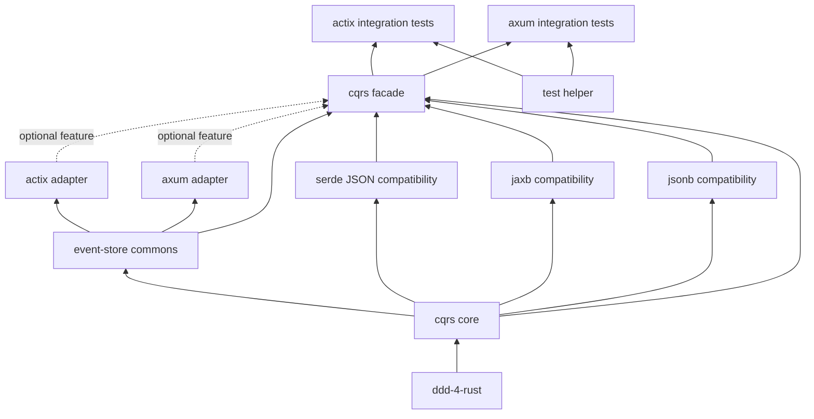

# cqrs-4-rust 顶层架构设计

- 日期: 2026-07-23
- 范围: workspace 拓扑、依赖方向、命名规范、门禁
- 状态: 已对齐，已实施；本规范作为不可变基线

## 1. 背景

把 Java 版 `cqrs-4-java 0.6.0`（提交 `1e9d64f58a11f2bc978ce687d98eba811eb9b022`）以 1:1 行为契约移植到 Rust。Java 仓库 141 个 `.java` 中，去掉 Maven Wrapper 后剩 140 个可迁移职责；Rust 端必须产出 140 个对应 `.rs` 文件，禁止用空文件、占位类型或转发 re-export 凑数。

权威逐文件账本: [`../plans/2026-07-23-cqrs-4-rust-migration-accounting.csv`](../plans/2026-07-23-cqrs-4-rust-migration-accounting.csv)，每条映射双向唯一。

## 2. 目标

1. 一比一迁移 140 个 Java 文件，行为契约、错误语义、序列化协议、测试场景与 Java 等价。
2. 建立 Cargo workspace，下沉基础设施 `core` / `esc` / 序列化三线（serde 对齐 Jackson，jaxb、jsonb 兼容线独立），框架适配层独立为 `adapter/axum`（源 Spring Boot）与 `adapter/actix`（源 Quarkus）。
3. `core` 不得依赖 Tokio、Actix、Axum、SQL 数据库或具体序列化器；框架 crate 之间不得互相依赖。
4. 端到端可用：内存 EventStore 下读模型投影闭环；真实 KurrentDB / MariaDB / Docker 链路作为后续验收目标。

## 3. 非目标

1. 重写领域语义或新增业务能力（保持行为等价）。
2. 引入超出 Java 基线特性的 Rust 独有抽象（如 `async-trait` 之外的多 trait 变体）。
3. 引入 TLS / OAuth / 多租户等基线之外能力。

## 4. Workspace 拓扑

```text
cqrs-4-rust/
├── Cargo.toml                  # virtual workspace
├── crates/
│   ├── cqrs/                   # feature-gated public facade
│   ├── core/                   # Command / Aggregate / Executor / Result
│   ├── esc/                    # event-store commons: dispatcher + projection service
│   ├── serialization/
│   │   ├── serde/              # Java jackson 模块的 Rust 对齐实现
│   │   ├── jaxb/               # XML 兼容线
│   │   └── jsonb/              # JSON-B 兼容线（inventory 编译期注册）
│   ├── adapter/
│   │   ├── actix/              # 源 Quarkus
│   │   └── axum/               # 源 Spring Boot
│   └── test/
│       ├── support/            # TestHelper（容器配置契约）
│       ├── actix/              # 源 test/quarkus 集成测试
│       └── axum/               # 源 test/springboot 集成测试
└── xtask/                      # 迁移、对账、覆盖率自动化
```

## 5. 依赖方向（必须是有向无环图）



禁止：

- `core` 依赖任何运行时框架、数据库、序列化器实现。
- `axum` ↔ `actix` 互相依赖。
- `xtask` 在生产依赖图中被任何 crate 引用。

## 6. 命名规范

| 维度 | 规范 |
|---|---|
| 目录 / 模块 / 文件 | `snake_case`（如 `projection_position/`、`event_store_config.rs`） |
| Cargo package 名 | `kebab-case`（如 `cqrs-4-rust-core`） |
| 结构体 / 枚举 / trait / 类型别名 | `PascalCase` |
| 常量 | `SCREAMING_SNAKE_CASE` |
| 函数 / 变量 | `snake_case` |
| Edition | 2024（resolver 3，MSRV 1.88） |
| 模块布局 | 小模块单文件 `foo.rs`；存在子模块用 `foo.rs + foo/`，不创建 `mod.rs` |
| `lib.rs` | 只放模块声明、crate 文档与定向 `pub use`；禁止 glob re-export |
| 可见性 | 默认私有；公共 API 用 `pub`，内部协作优先 `pub(crate)` |
| 依赖策略 | 统一声明在根 `[workspace.dependencies]`；内部 path dep 同时声明 `version` |
| Tokio | 禁止 `features = ["full"]`，只启用实际所需 feature |

## 7. 模块对账（基线 140 文件）

| Java 模块 | Java main/src-gen | Java test | 合计 | Rust 目标 | Rust 位置 |
|---|---:|---:|---:|---:|---|
| `core` | 15 | 6 | 21 | 21 | `crates/core/` |
| `esc` | 3 | 3 | 6 | 6 | `crates/esc/` |
| `jackson` | 8 | 14 | 22 | 22 | `crates/serialization/serde/` |
| `jaxb` | 5 | 10 | 15 | 15 | `crates/serialization/jaxb/` |
| `jsonb` | 8 | 14 | 22 | 22 | `crates/serialization/jsonb/` |
| `springboot` | 4 | 6 | 10 | 10 | `crates/adapter/axum/` |
| `quarkus` | 4 | 6 | 10 | 10 | `crates/adapter/actix/` |
| `jacoco` | 1 | 0 | 1 | 1 | `xtask/src/coverage.rs` |
| `test/helper` | 1 | 0 | 1 | 1 | `crates/test/support/` |
| `test/quarkus` | 13 | 5 | 18 | 18 | `crates/test/actix/` |
| `test/springboot` | 12 | 2 | 14 | 14 | `crates/test/axum/` |
| **合计** | **90** | **50** | **140** | **140** | |

Maven Wrapper 由 Cargo / rustup 替代，禁止伪造 `maven_wrapper_downloader.rs`。

## 8. 完成定义（不可妥协）

1. Java 可迁移源 = 140；Rust 对应源 = 140；账本双向唯一（`tools/check_migration_parity.sh` 通过）。
2. 工作区门禁通过：
   - `cargo fmt --all -- --check`
   - `cargo check --workspace --all-targets --all-features`
   - `cargo test --workspace --all-targets --all-features`
   - `cargo clippy --workspace --all-targets --all-features -- -D warnings`
   - `cargo doc --workspace --all-features --no-deps`
3. 禁止出现：`todo!()`、`unimplemented!()`、空 dispatch、仅日志 scheduler、占位 helper。
4. README 示例必须以 doctest 或 integration test 形式编译运行，不允许文档声明不存在的 API。
5. 发布前：`cargo tree --duplicates`、`cargo deny check`、`cargo audit`。

## 9. 核心类型映射

| Java | Rust | crate |
|---|---|---|
| `Command extends Event` | `Command: Event` trait | core |
| `AggregateCommand<ROOT, ENTITY>` | `AggregateCommand<RootId, EntityIdType>` trait | core |
| `CommandExecutor<CTX, RESULT, CMD>` | `CommandExecutor<Ctx, Cmd>` trait | core |
| `Result<DATA>` | `CqrsResult<D>` struct | core |
| `SimpleResult` | `type SimpleResult = CqrsResult<()>` | serde / jaxb / jsonb |
| `DataResult<DATA>` | `type DataResult<D> = CqrsResult<D>` | serde / jaxb / jsonb |
| `JpaView` | `JpaView` trait | core |
| `JpaEventHandler<TYPE>` | `JpaEventHandler<E>` trait | core |
| `SpringJpaViewManager` | `ViewManager` (axum) | axum |
| `QuarkusJpaViewManager` | `ViewManager` (actix) | actix |

## 10. 分层示意

```text
┌─────────────────────────────────────────────────────────────┐
│  应用层（用户代码）                                            │
│    use cqrs_4_rust_core::prelude::*;                        │
│    struct CreatePersonCommand;                               │
└─────────────────────────┬───────────────────────────────────┘
                          │
        ┌─────────────────┼─────────────────┐
        │                 │                 │
┌───────▼───────┐  ┌──────▼──────┐  ┌──────▼──────────────┐
│  cqrs-4-rust- │  │  cqrs-4-rust- │  │  cqrs-4-rust-       │
│  core         │  │  serde       │  │  actix / axum        │
│  (同步)       │  │  (同步)      │  │  (async)             │
│               │  │              │  │                      │
│  Command      │  │  AbstractCmd │  │  ViewManager         │
│  CommandExec  │  │  CqrsResult  │  │  EventStoreConfig    │
│  Result       │  │  DataResult  │  │  ProjectionPosition  │
│  View         │  │  SimpleResult│  │                      │
│  JpaView      │  │              │  └──────────────────────┘
│  JpaEventHandler│ └──────────────┘
└───────────────┘
```

## 11. 向后兼容

不允许。本规范是 `cqrs-4-rust` 的第一份契约；后续若新增能力，需新开 spec，不允许在本文档追加。

## 12. 命名清单（公共 API 入口）

- `cqrs_4_rust_core::Command` / `AggregateCommand` / `CommandExecutor` / `CqrsResult` / `View` / `JpaView` / `JpaEventHandler`
- `cqrs_4_rust_esc::JpaEventDispatcher` / `SimpleJpaEventDispatcher` / `ProjectionService` + 内部共享引擎（`ProjectionStreamId` / `ProjectionAdmin` / `EventDecoder` / `ViewProjector` / `ManagedView`）
- `cqrs_4_rust_serde::{AbstractCommand, AbstractAggregateCommand, AbstractResult, DataResult, SimpleResult, Cqrs4SerdeModule}`
- `cqrs_4_rust_jaxb` / `cqrs_4_rust_jsonb` 同上形态
- `cqrs_4_rust_axum::AxumJpaViewManager` / `cqrs_4_rust_actix::ActixJpaViewManager` + 公共 `ViewManager` trait